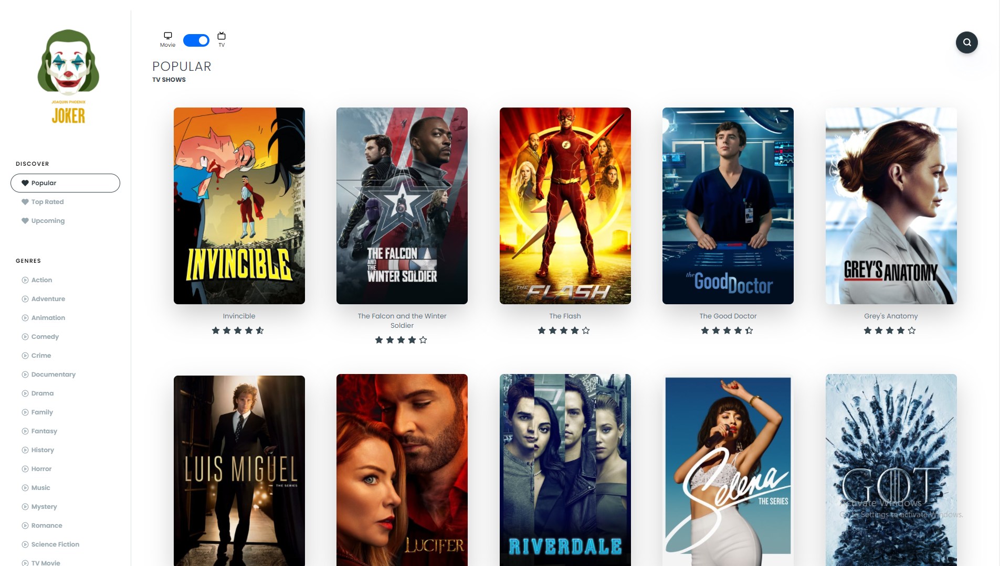

# Movie Library w/ NextJS

## [Check it live here](https://nextjs-movie-olive.vercel.app/)



A Movie Library made with NextJS using The Movie Database API

## Getting Started

These instructions will get you a copy of the project up and running on your local machine for development and testing purposes. See deployment for notes on how to deploy the project on a live system.

### Prerequisites

You need to create an API KEY in [The Movie Database API](https://www.themoviedb.org/documentation/api)
Create an .env.local file on the root of the project and put your API key

```
REACT_APP_API=yourapikeyhere
```

### Installing

Clone the Repository and run

```
yarn install
yarn dev
```

## Deployment

To deploy simply run

```
yarn run build
```

## Built With

- [Next JS](https://nextjs.org/)
- [React Query](https://react-query.tanstack.com/)
- [Styled Components](https://www.styled-components.com)

## Contributing

Please feel free to send pull request if you want to contribute!

## Authors

- Miroz Devkota - _Development_ - [Author](https://mirozdevkota.com.np/)
